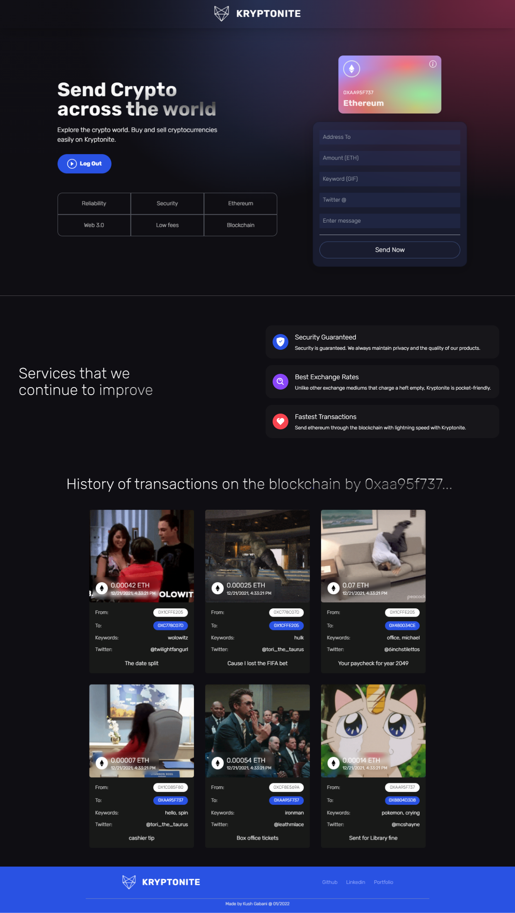

<div style="text-align: center;">

# Kryptonite
A web 3.0 React-Solidity blockchain application for ethereum cryptocurrency exchange.

</div>


<hr />

## 🎃 Technologies Used
- React.js
- Solidity
- Hardhat
- Tailwindcss


## 🏭 Prerequisites
- Node.js@latest **[stable version]** 
- npm
- MetaMask extension in the browser





## 🚀 Set up in a local environment

1. Clone the repository
```shell
git clone https://github.com/KushGabani/Kryptonite
cd kryptonite
```

2. install the required packages and dependencies
```shell
cd krypt-client && npm install
cd ..
cd blockchain-contract && npm i
```
3. Create a new [Alchemy](https://www.alchemy.com/) app with Ethereum as the blockchain and Ropsten as our network which will allow us to manage Blockchain API calls on our Metamask account.
4. Create or signup to a MetaMask account and save the 12-word phrase in a secure place for personal future reference.
5. Go to `settings > advanced settings` in your MetaMask browser extension and enable `Test Networks`.
6. Then, Select the `Ropsten Network` from the MetaMask extension home page. The ropsten network is a test network in the ethereum blockchain.  
7. Copy the registered address and get test ETH from [Ropsten Faucet ETH](https://faucet.egorline.com)
8. Export the Private Key of our MetaMask account from `more` options and copy it.
9. Configure hardhat by creating a `.env` file for `blockchain-contract/hardhat.config.js`.
```dotenv
ALCHEMY_ENDPOINT=YOUR_HTTP_ALCHEMY_ENDPOINT
METAMASK_PRIVATE_KEY=METAMASK_PRIVATE_KEY
```
10. Compile the Solidity blockchain contract with hardhat by running this command in the `blockchain-contract` directory.
```shell
npx hardhat run scripts/deploy.js --network ropsten
```
11. Copy the contract address of the artifact given as the output of the command above and replace it with `contractAddress` in `krypt-client/src/utils/constants.js`
12. Get the artifact created with hardhat by copying the entire file: `blockchain-contract/artifacts/contracts/Transactions.sol/Transactions.json`
13. Paste the entire artifact by replacing the content in `krypt-client/src/utils/transactions.json`
14. To query Gifs using keywords, I use API provided by [developers.giphy.com](https://developers.giphy.com). Create an account on Giphy and copy the API key provided.
15. Create a `.env` file in `krypt-client/src/` and write the following -
```dotenv
VITE_GIPHY_API=YOUR_GIPHY_API_KEY
```
16. Congratulation ✨! You've completed the setup, and you can run the `npm run dev` or `vite` command from the terminal in the `krypt-client/` directory

> You can access the web application in localhost:3000/


## 💎 Features
- Users can connect their metamask wallets in-app
- Provided a receiver address, the user can send ETH and each transaction requires `21,000 Gwei || 0.000020223 ETH` as gas fees.
- Along with the transaction, the user can specify their **twitter @** and a keyword through which a gif is attached to the memory of the blockchain
- Users can view all their transactions on the blockchains as user-friendly cards with etherscan links associated to each transaction.